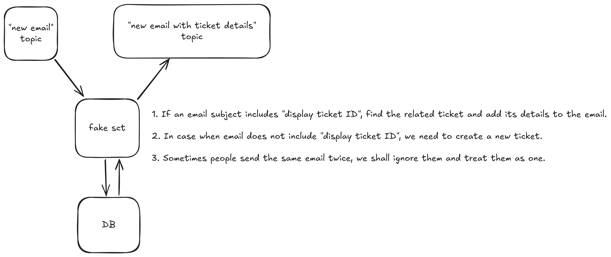

Example email message:

With id:
```json
{
  "subject": "New issue reported - ID-1234",
  "body": "Hello, we've received your request and will get back to you shortly.",
  "sender": "support@example.com",
  "receiver": "user@example.com"
}

```

Without id:
```json
{
  "subject": "Another issue reported",
  "body": "Hello, we've received your request and will get back to you shortly.",
  "sender": "support2@example.com",
  "receiver": "user2@example.com"
}

```

